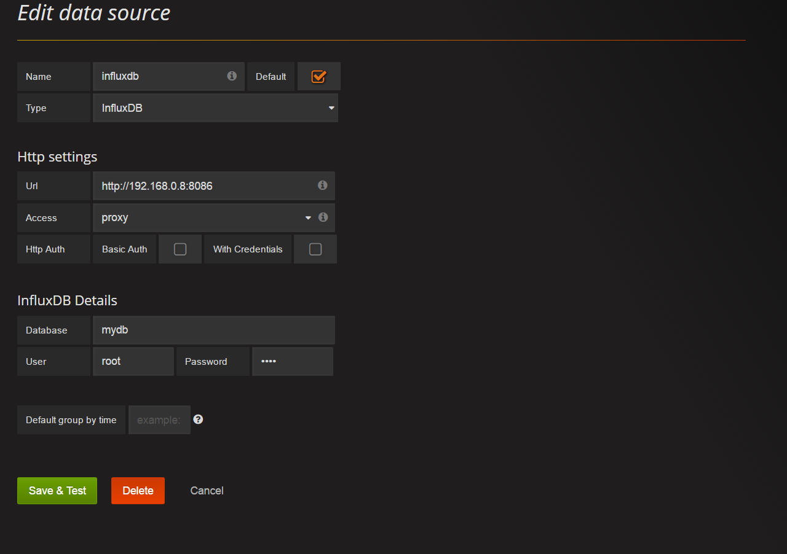
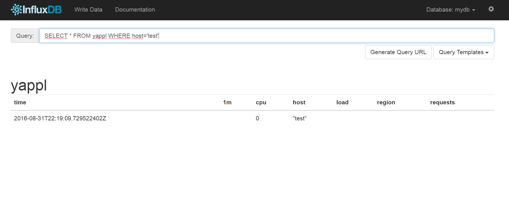
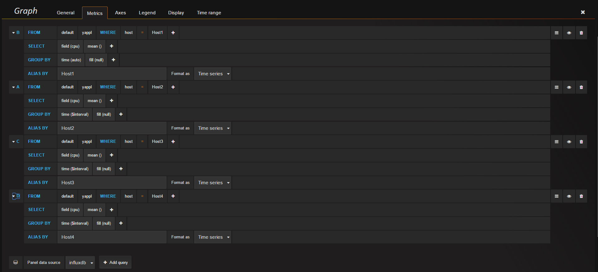
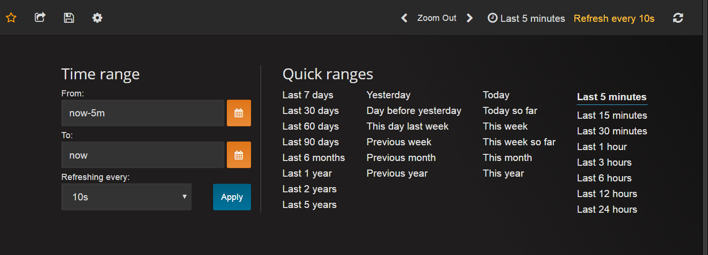
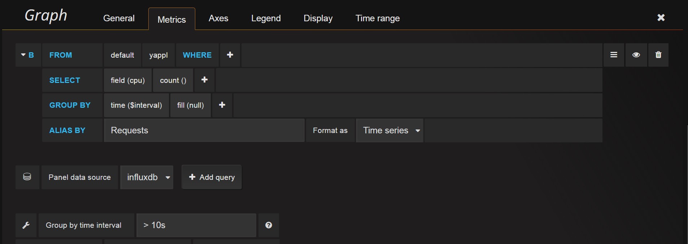

## Data visualization with InfluxDB and Grafana

The purpose of this post will be to show how one can use InfluxDB and Grafana to display custom graphs. Down below is how the final output looks like. One graph showing the total requests of the system and the other the CPU of imaginery hosts.

Down below are the things that we will go through.

1. Brief introduction of InfluxDB and Grafana
2. Setting up Influxdb and Grafana using Docker
3. Running the Scala application
4. Sending in data to InfluxDB
5. Creating graphs in Grafana

### InfluxDB

InfluxDB is an open source time series database. It's useful for recording metrics, events, and performing analytics.

### Grafana

Grafana is an open source metrics dashboard and graph editor for several datasources such as Graphite, Elasticsearch, OpenTSDB, Prometheus and InfluxDB

### Setting up InfluxDB and Grafana

Both InfluxDB and Grafana will be set up using their respective offical docker image. If you don't know what Docker is then I would recommend to check it out.

[Docker](https://www.docker.com/)

The commands below assume you have Docker installed.

**Running the InfluxDB container:**

    sudo docker run --restart=always -d -p 8083:8083 -p 8086:8086 \
    -v $PWD:/var/lib/influxdb \
    influxdb

What the command above does is that it will first download the offical InfluxDB image from the public docker repository. After that it will start the container using the download image. Two ports are exposed from inside the container, 8083 is used for the Administrator interface and 8086 is the HTTP API port which requests are sent to.

    -p 8083:8083

The port on the right side is the port used on the inside of the container and on the left side is which port we can access it on the outside. We could have used another random port instead of 8083 on the left side.

    -v $PWD:/var/lib/influxdb

Here we attach a data volume to the container. $PWD translates into the current directory that you are in, so smartest would be to create a InfluxDB directory somewhere, make sure that you are running the docker command while inside it. This volume flag works similar as the port one. The data inside the container at /var/lib/influxdb will be mounted to $PWD on the outside of the container. This allows us to have persistent storage in case the container dies etc..

InfluxDB should now be running and to verify it, see if you can open up the administrator interface at your-ip:8083.

Now before moving on to the Grafana part lets create a database in InfluxDB.

    curl -G 'http://localhost:8086/query --data-urlencode "q=CREATE DATABASE mydb"

**Running the Grafana container:**

    # Create /var/lib/grafana as persistent volume storage
    sudo docker run -d -v /var/lib/grafana --name grafana-storage busybox:latest

    # Running Grafana
    sudo docker run --restart=always -d -p 3000:3000 \
    --name=grafana --volumes-from grafana-storage \
    grafana/grafana

The Grafana container will also use a persistent volume but it is configured differently, I will not go into details on it.

After the container is running you should be able log into Grafana at your-ip:3000. Default username and password is admin. First thing that needs to be done is to add InfluxDB as the default data source. Down below are the settings that are needed. Make sure to replace 192.168.0.8 with your own IP. User and Password is root.

### Running the REST API

The REST API is created using Akka HTTP, to run the application you will need Scala's SBT(Simple Build Tool). 

The project can be cloned from the following link https://github.com/yappl/influxdb-grafana-scala-example.git

Running it in the terminal:
    
    # Needs to be run in the folder where build.sbt resides
    sbt run

Another option is to open the project in a IDE such as intellij IDEA. Just make sure that you have Scala installed.

If you see the line Starting up server at localhost:8080 then you should be good to go. To verify it works execute this curl command.

    curl -H "Content-Type: application/json" -X POST -d '{"hostName":"test", "cpu":0.00}' http://localhost:8080/dump

Head over to the InfluxDB administrator interface at ip:8083 and choose the database mydb. If everything is working then the query below should show your test input.

    SELECT * FROM yappl WHERE host='test'

### Sending data into InfluxDB

In the project repository there is a folder called scripts. Inside it there are 4 shell scripts that continuously send requests to the REST interface and inputs fake CPU stats. Open up 4 terminals and start every single script. 

### Configuring Grafana to show the graphs

Head over to the Grafana interface again. It is time to create a dashboard. On the left side you should be able to see a little green box, if you hover over that you should be able to see an option called Add Panel. Click on it and choose Graph. Click on the Panel Title and you should be able to see a Edit option. 

Give the title "CPU Usage" to the graph. Next go to the metrics tab, then make sure that Panel data source is selected as influxdb. Next step is to add queries that Grafana will perform against InfluxDB. Down below is how the first query should be configured, then simply just add 3 others and make sure that the correct Host is chosen. (Host1, Host2, ...)

If you are wondering what MEAN() is then look no futher, MEAN() returns the arithmetic mean(average) of the specified column over a given interval.

When you have added the 4 queries then it should look like something like the image below.

Up in the right corner of Grafana you can set the time ranges. Best is to try them around. I can recommend enabling auto refresh, in the image it is set to 10s.

Hopefully now you should see something popping up in your graph. This is how mine looked after the scripts had been running for a few minutes. The graph will of course look different depending on the time interval you have choosed.

**Creating a graph that shows the requests coming in to the system:**

First repeat the same step as before and add a another graph to the panel. Then head to the metrics tab and add this query.

The results should look something like this.

### Finishing words

As you can see, InfluxDB and Grafana is a very neat combo to use for monitoring your applications.

[Github repository can be found here](https://github.com/yappl/influxdb-grafana-scala-example)

/ Max

